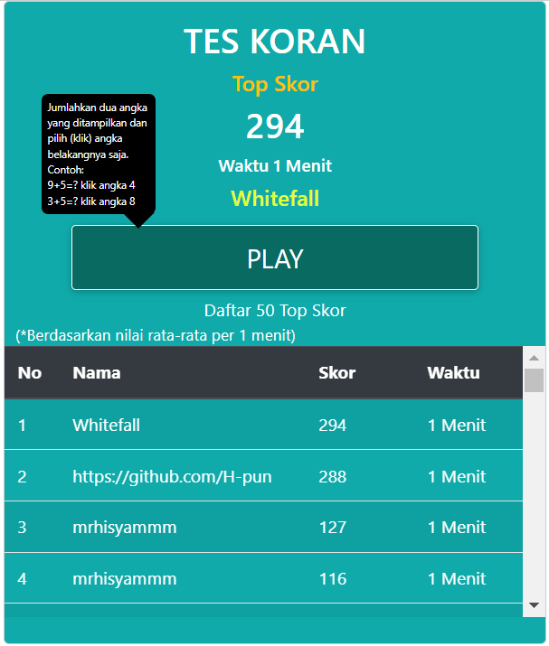

# Test Koran Automation

This application automates the process of answering questions on [Tes Koran](https://teskoran.com) using Python and Selenium.

## Features

- Automatically answers questions on Tes Koran.
- Easy to set up and run.

## Requirements

- Python 3.x
- Selenium
- WebDriver for your browser (e.g., ChromeDriver for Google Chrome)

## Installation

1. Clone the repository:

    ```sh
    git clone https://github.com/yourusername/tes-koran-automation.git
    ```
2. Navigate to the project directory:

    ```sh
    cd tes-koran-automation
    ```
3. Install the required packages:

    ```sh
    pip install -r requirements.txt
    ```

## Usage

1. Set the necessary constants in the script.

    ```python
    ERROR_RATE = 0.05  # 5% error rate
    DELAY = 1  # 1 second delay
    TIME_LIMIT = TimeLimit.ONE_MIN
    ```
2. Run the script:

    ```sh
    python main.py
    ```

## Result

Here is an example of the script in action:



## License

This project is licensed under the CC0-1.0 License. See the [LICENSE](LICENSE) file for details.

## Contributing

Contributions are welcome! Please open an issue or submit a pull request.
